# ADALM 2000 Labs

# Lab 0: ADALM Orientation

## Aim

To familiarize yourself with the ADALM2000 board, its features, and pin configuration.

## Introduction

The **ADALM2000 (M2K)** is a USB-powered portable electronics laboratory developed by Analog Devices. It integrates multiple test and measurement instruments into a single device, including an oscilloscope, waveform generator, digital logic analyzer, digital pattern generator, voltmeter, and programmable power supplies.

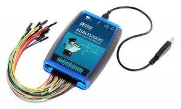

## Features

- Dual-channel Oscilloscope
- Two-channel Arbitrary Waveform Generator
- 16-channel Digital Input/Output
- Programmable Dual Power Supply
- USB Powered
- Compatible with Scopy Software

---

## Pin Configuration

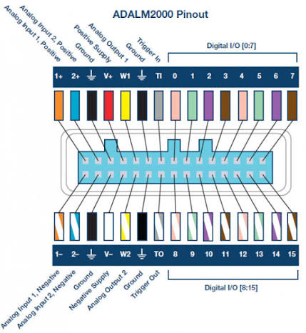

### Analog Pins

| Pin | Function |
|------|----------|
| 1+ | Analog Input Channel 1 (+) |
| 1− | Analog Input Channel 1 (−) |
| 2+ | Analog Input Channel 2 (+) |
| 2− | Analog Input Channel 2 (−) |
| W1 | Waveform Generator Channel 1 |
| W2 | Waveform Generator Channel 2 |

### Digital Pins

| Pin | Function |
|------|----------|
| DIO0–DIO15 | Digital Input/Output |

### Power Pins

| Pin | Function |
|------|----------|
| +5V | Fixed 5 V Output |
| V+ | Positive Adjustable Supply |
| V− | Negative Adjustable Supply |
| GND | Ground |

---

## Working Principle
The ADALM2000 communicates with a computer through USB and is controlled using the **Scopy** software. It can generate, measure, and analyze analog and digital signals while also supplying power to external circuits.

## Applications
- Analog circuit analysis
- Digital logic experiments
- Signal generation
- Sensor interfacing
- Embedded systems
- Electronics education

## Conclusion
The ADALM2000 is a compact and versatile learning platform that combines multiple laboratory instruments into a single USB-powered device, making it ideal for electronics experiments.

# Lab1: Introduction to ADALM 2000

## Activity 1: Voltage Source and DC Measurement

### Objective

Generate a DC voltage using the ADALM2000 power supply and verify it using the Scopy voltmeter.

### Procedure

- Built a circuit using a 1 kΩ resistor connected between the power supply and ground.
- Set the positive supply to 3 V and 4 V using Scopy.
- Measured the output voltage across the resistor using the voltmeter.
- Recorded the measured values for each supply setting.

### Observations

For 3 V:

For 4 V:

The measured voltages closely matched the applied supply voltages, with only minor variations due to measurement accuracy and component tolerances.

### Conclusion

Verified the operation of the ADALM2000 DC power supply and Scopy voltmeter, and understood the importance of proper grounding and safe circuit connections.

### Questions & Answers

Q1. Why is the measured voltage not always exactly equal to the set value?

Ans: Due to instrument accuracy limits, component tolerances, and measurement uncertainty.

Q2. What is the role of the ground (reference) connection in this circuit?

Ans: It provides a common reference point and completes the electrical circuit for accurate measurements.

Q3. Why should the power supply be turned off before changing the circuit wiring?

Ans: To prevent short circuits, protect the components, and ensure user safety.

## Activity 2: Voltmeter and Resistance Check

### Objective

Measure the output voltage of a resistor divider using the ADALM2000 voltmeter.

### Procedure

- Built a voltage divider using two 1 kΩ resistors in series.
- Applied +3.0V first, across the divider.
- Measured the midpoint voltage with the Scopy voltmeter.
- Then applied +4.0V, across the divider.
- Measured the midpoint voltage with the Scopy voltmeter.
- Compared the measured value with the theoretical value.

### Circuit Diagram

The resistor divider circuit is designed like this:

### Observation

The measured midpoint voltage was approximately 1.5 V, which closely matched the expected value.

The measured midpoint voltage was approximately 2.0 V, which closely matched the expected value.

### Conclusion

Verified the operation of a voltage divider and the use of the ADALM2000 voltmeter for DC voltage measurements.

### Questions & Answers

Q1. Why must resistance be measured only when the circuit is unpowered?

Ans: To avoid inaccurate readings and protect the multimeter from damage.

Q2. In the divider circuit, why is the midpoint near half the supply voltage?

Ans: Because two equal resistors divide the supply voltage equally.

Q3. How would the midpoint voltage change if one resistor were much larger than the other?

Ans: The midpoint voltage shifts toward the end connected to the larger resistor, following the voltage-divider rule.

## Activity 3: Waveform Generator

### Objective

Generate and observe different waveforms using the ADALM2000 waveform generator.

### Procedure

- Connected W1 of the waveform generator to Oscilloscope Channel 1.
- Generated a 1 kHz, 1 Vpp sine wave with 0 V offset.
- Observed the waveform using the Scopy oscilloscope.
- Changed the output waveform from sine to square while keeping the same frequency.

### Observation

Both sine and square waves were generated successfully and displayed correctly on the oscilloscope.

### Conclusion

Verified the operation of the ADALM2000 waveform generator and learned to generate and observe different signal waveforms.

### Questions & Answers

Q1. Why is a waveform generator used?

Ans: To generate test signals for analyzing and testing electronic circuits.

Q2. What is the effect of changing the waveform from sine to square?

Ans: The output shape changes while the frequency remains the same.

Q3. Why is the oscilloscope connected to the waveform generator?

Ans: To observe and verify the generated signal.

## Activity 4: Oscilloscope

### Objective

Observe and measure waveform parameters using the ADALM2000 oscilloscope.

### Procedure

- Displayed the generated waveform on Oscilloscope Channel 1.
- Adjusted the volts/div and time/div settings for a clear display.
- Measured the peak-to-peak voltage and time period of the waveform.
- Calculated the frequency using the measured time period.

### Observation

The measured frequency was approximately 1 kHz, matching the waveform generator setting.

### Calculation

Frequency = 1 / Time Period

So if T = 1 ms, then f = 1 kHz

### Conclusion

Verified the operation of the oscilloscope and measured waveform parameters accurately.

### Questions & Answers

Q1. How does changing the time/div setting affect the displayed waveform?

Ans: It changes the horizontal scale, showing more or fewer waveform cycles.

Q2. How does changing the volts/div setting affect the displayed waveform?

Ans: It changes the vertical scale, making the waveform appear larger or smaller.

Q3. Why is triggering important for a stable display?

Ans: It synchronizes the waveform, producing a steady and stable display.

Q4. Compare the measured frequency with the generator setting. Are they close?

Ans: Yes, the measured frequency was very close to the generator setting, with only minor measurement error.

# Lab 2: Voltage divider, Thevenin equivalance

## Objective

Design a resistor divider to generate 1.5 V from a 3 V supply and verify its Thévenin equivalent using the ADALM2000.

## Procedure

- Designed a two-resistor voltage divider to obtain 1.5 V from a 3 V DC source.
- Calculated the Thévenin voltage and Thévenin resistance of the divider.
- Measured the open-circuit output voltage using the Scopy voltmeter.
- Connected different load resistors and observed the output voltage variation.
- Compared the measured results with theoretical calculations.

## Calculations

### Given

- Supply Voltage, **VCC = 3 V**
- Required Output Voltage, **VOUT = 1.5 V**
- Divider Current, **I ≈ 1 mA**

### Step 1: Calculate Total Resistance

Using Ohm's Law,

**RTotal = VCC / I**

= 3 V / 1 mA

= **3 kΩ**

### Step 2: Calculate Resistor Values

Since,

**VOUT = VCC / 2**

The divider requires equal resistors.

**R1 = R2 = 3 kΩ / 2 = 1.5 kΩ**

### Step 3: Calculate Thévenin Voltage

**VTH = VOUT = 1.5 V**

### Step 4: Calculate Thévenin Resistance

**RTH = R1 || R2**

= (1.5 kΩ × 1.5 kΩ) / (1.5 kΩ + 1.5 kΩ)

= **750 Ω**

---

## Final Values

| Parameter | Value |
|-----------|:-----:|
| Supply Voltage (VCC) | **3 V** |
| Resistor R1 | **1.5 kΩ** |
| Resistor R2 | **1.5 kΩ** |
| Divider Current | **1 mA** |
| Thévenin Voltage (VTH) | **1.5 V** |
| Thévenin Resistance (RTH) | **750 Ω** |

## Resistor Used

As there is no 1.5k resistor avaialble, so we connected 1.2k and 330 Ω resistor in series which nearly equals 1.5k for the experiment.

## Observation

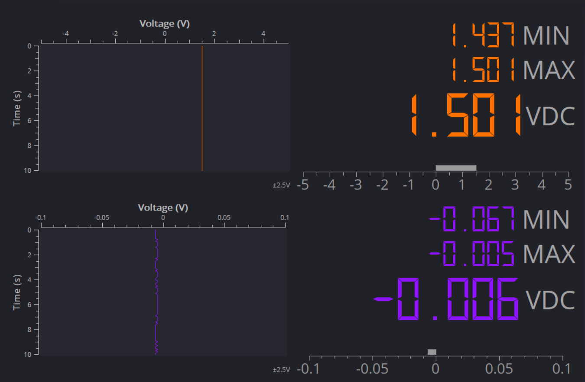

The divider produced approximately 1.5 V under no-load conditions. The output voltage decreased with heavier loads due to the Thévenin resistance.

The current was measured using multimeter and was found to be 0.94 mA, which is nearly same as target value of 1 mA.

## Conclusion

Verified the operation of a resistor divider and understood the effect of loading using Thévenin equivalent analysis.

# Lab 3: FFT: Sine Vs Square

Frequency-domain representation comparing sine and square signals, highlighting harmonic structure where sine shows a single dominant peak and square wave exhibits multiple harmonic components:

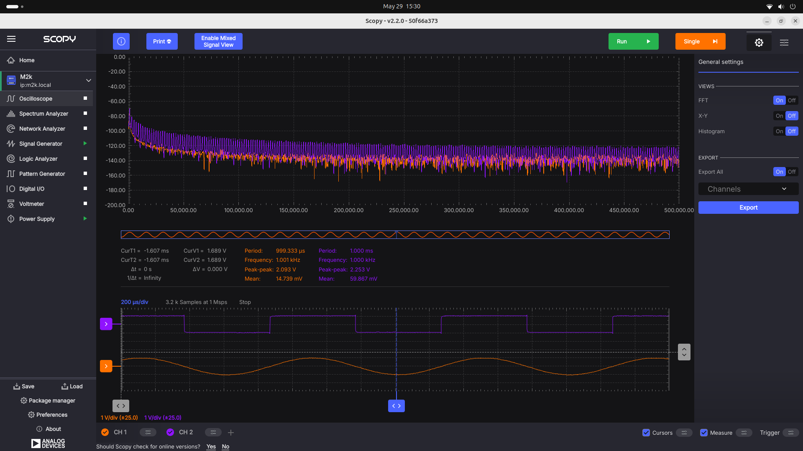

Frequency-domain analysis of a pure sine wave showing a single dominant peak at the fundamental frequency, demonstrating minimal harmonic distortion:

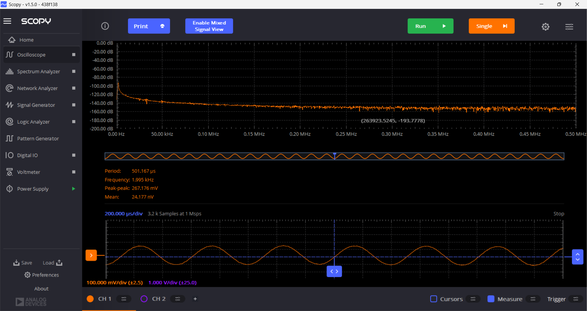

High-resolution frequency-domain analysis of a sine wave showing precise spectral components, noise floor behavior, and improved frequency resolution compared to basic FFT visualization:

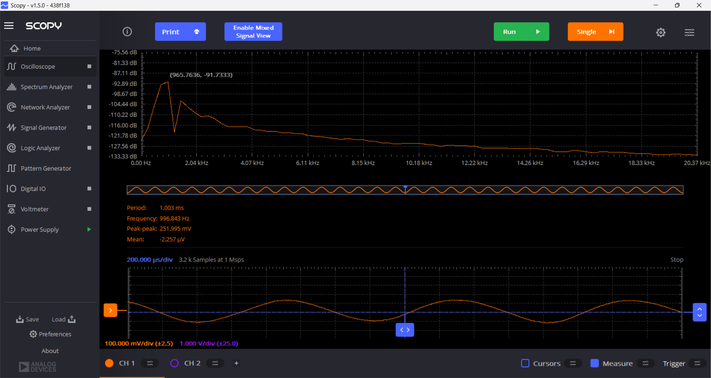

# Lab 4 RC Transient Response And Bode Plot

## Low Pass Filter

The RC Circuit connection is given below:

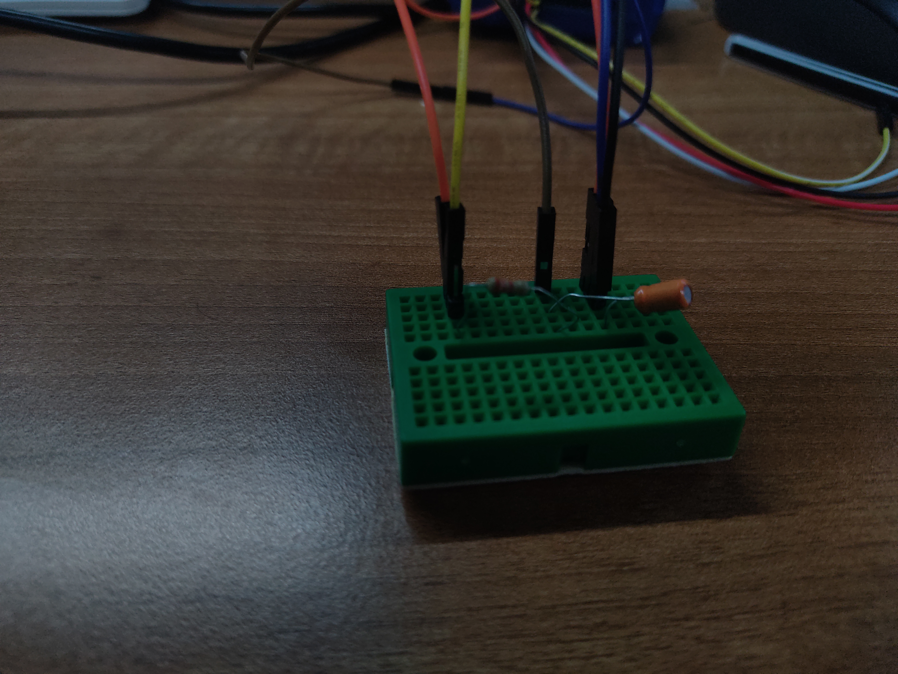

The RC Response for T > τ is given below:

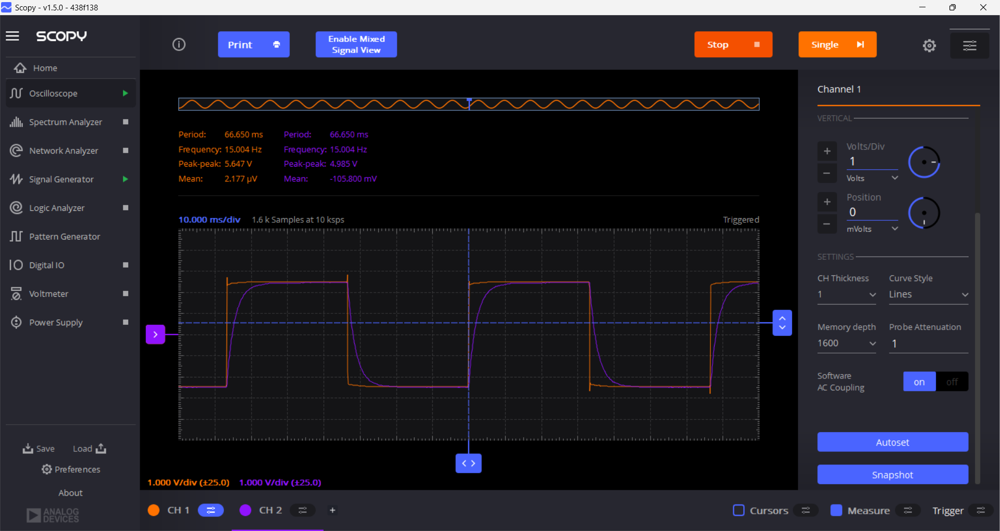

The RC Response for T < τ is given below:

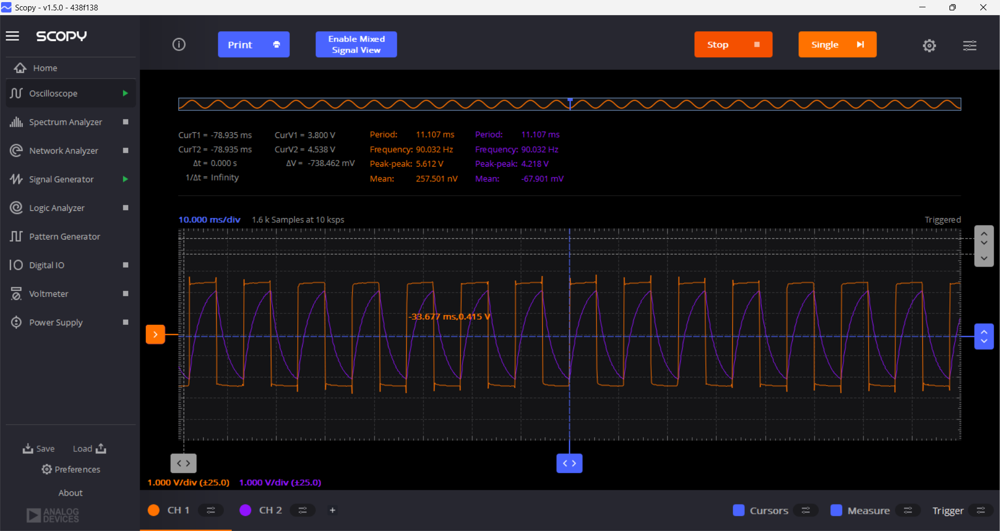

The Bode Plot of RC Low Pass Filter is given below:

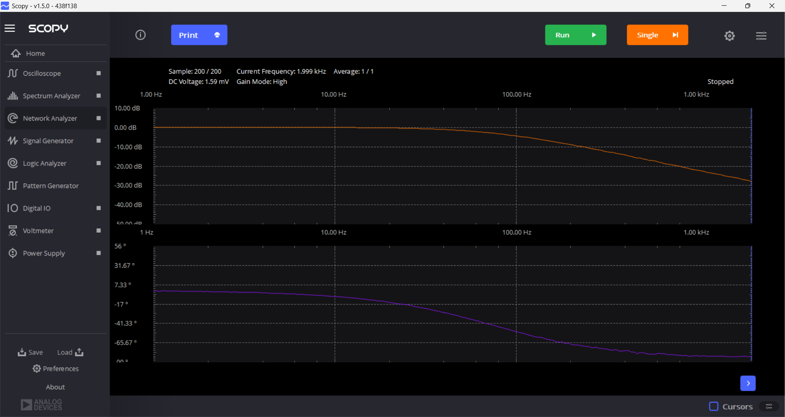

## High Pass Filter

The RC Circuit connection is given below:

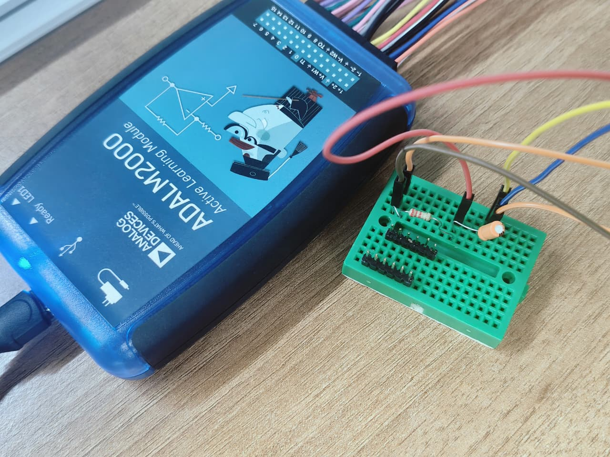

The RC Response for T > τ is given below:

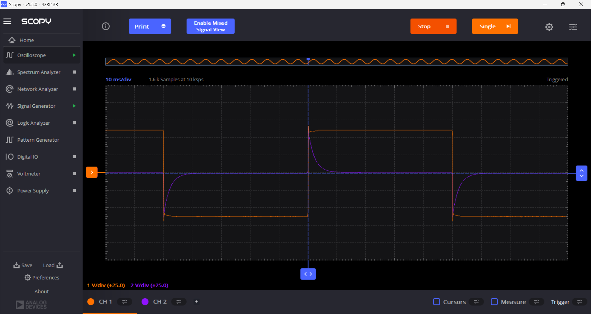

The RC Response for T < τ is given below:

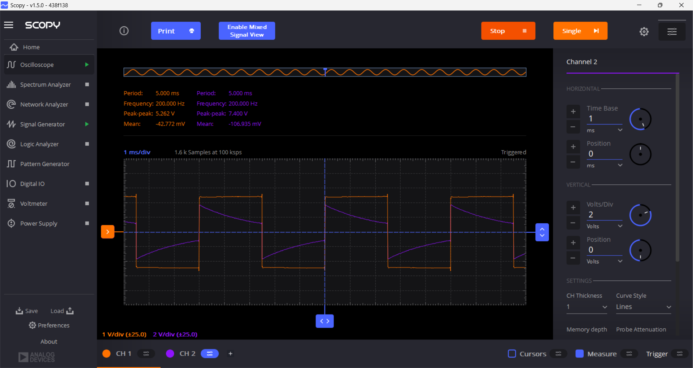
