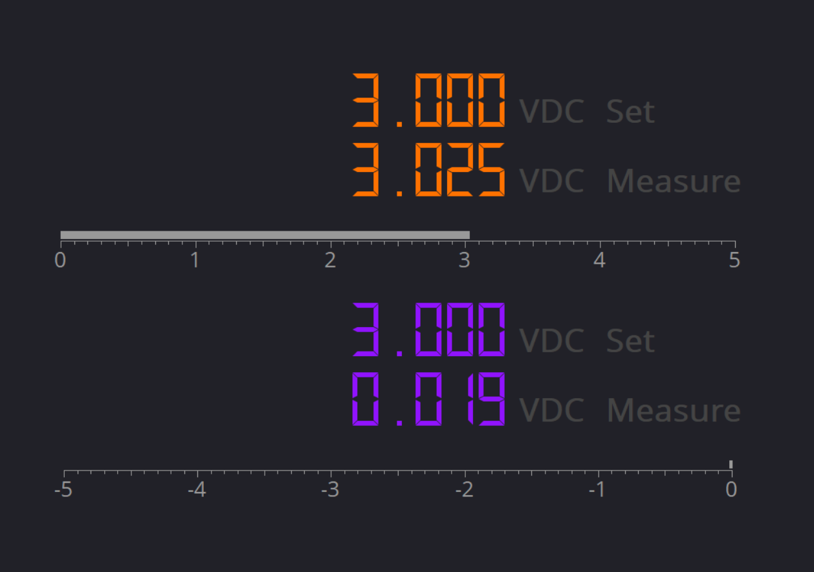
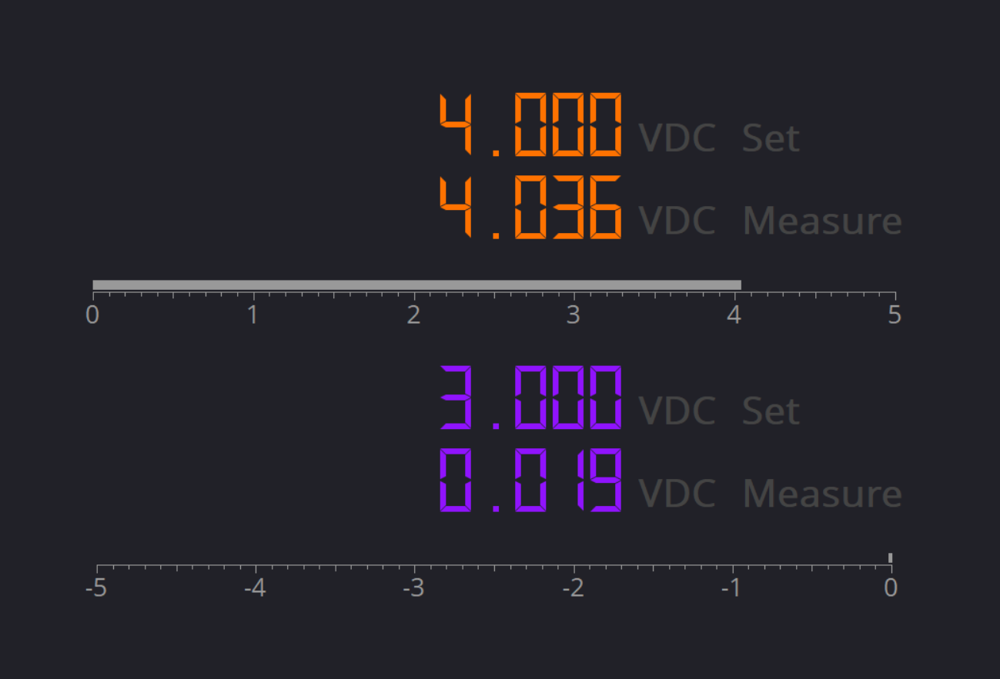
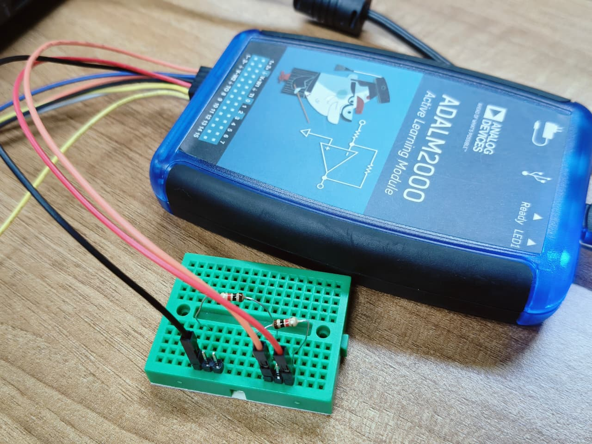
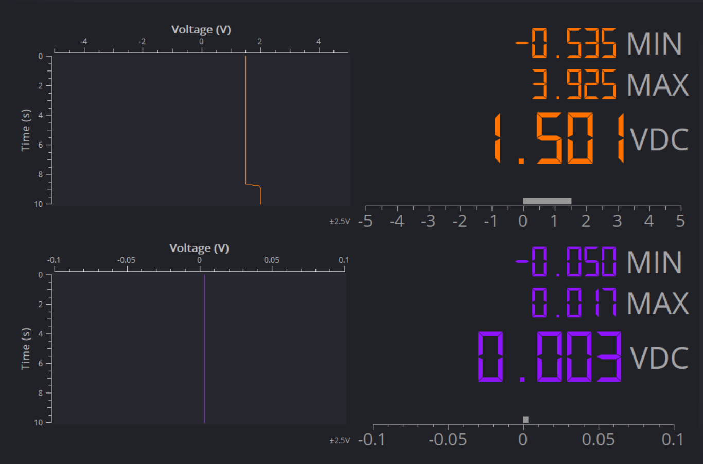
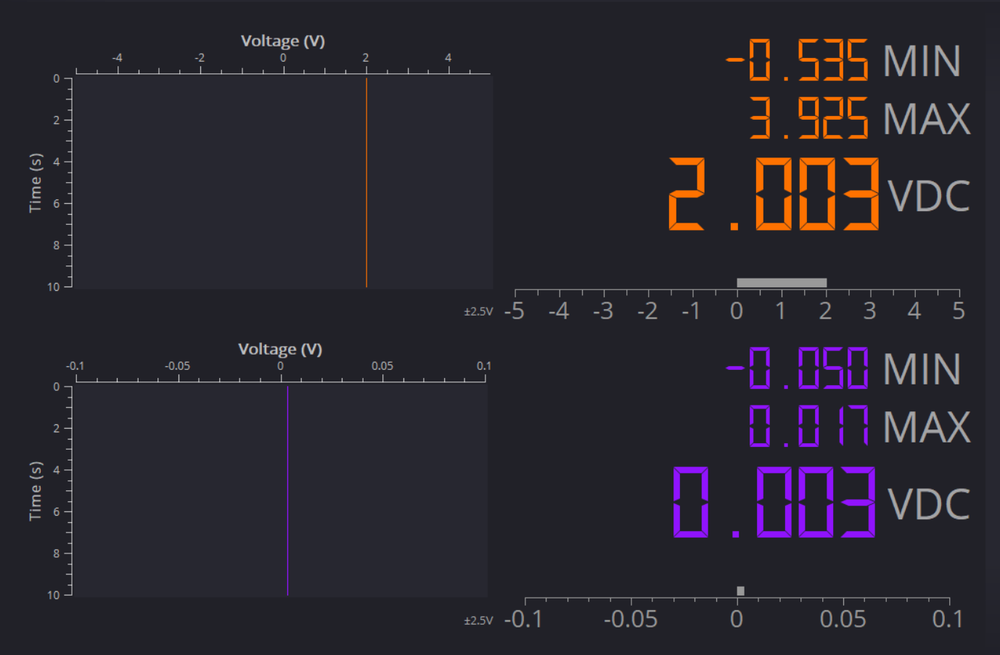

# ADALM 2000 Labs

# Lab0: ADALM Orientation

# Activity 1: Voltage Source and DC Measurement

## Objective

Generate a DC voltage using the ADALM2000 power supply and verify it using the Scopy voltmeter.

## Procedure

- Built a circuit using a 1 kΩ resistor connected between the power supply and ground.
- Set the positive supply to 3 V and 4 V using Scopy.
- Measured the output voltage across the resistor using the voltmeter.
- Recorded the measured values for each supply setting.

## Observations

For 3 V:

For 4 V:

The measured voltages closely matched the applied supply voltages, with only minor variations due to measurement accuracy and component tolerances.

## Conclusion

Verified the operation of the ADALM2000 DC power supply and Scopy voltmeter, and understood the importance of proper grounding and safe circuit connections.

## Questions & Answers

Q1. Why is the measured voltage not always exactly equal to the set value?

Ans: Due to instrument accuracy limits, component tolerances, and measurement uncertainty.

Q2. What is the role of the ground (reference) connection in this circuit?

Ans: It provides a common reference point and completes the electrical circuit for accurate measurements.

Q3. Why should the power supply be turned off before changing the circuit wiring?

Ans: To prevent short circuits, protect the components, and ensure user safety.

# Activity 2: Voltmeter and Resistance Check

## Objective

Measure the output voltage of a resistor divider using the ADALM2000 voltmeter.

## Procedure

- Built a voltage divider using two 1 kΩ resistors in series.
- Applied +3.0V first, across the divider.
- Measured the midpoint voltage with the Scopy voltmeter.
- Then applied +4.0V, across the divider.
- Measured the midpoint voltage with the Scopy voltmeter.
- Compared the measured value with the theoretical value.

## Circuit Diagram

The resistor divider circuit is designed like this:

## Observation

The measured midpoint voltage was approximately 1.5 V, which closely matched the expected value.

The measured midpoint voltage was approximately 2.0 V, which closely matched the expected value.

## Conclusion

Verified the operation of a voltage divider and the use of the ADALM2000 voltmeter for DC voltage measurements.

## Questions & Answers

Q1. Why must resistance be measured only when the circuit is unpowered?

Ans: To avoid inaccurate readings and protect the multimeter from damage.

Q2. In the divider circuit, why is the midpoint near half the supply voltage?

Ans: Because two equal resistors divide the supply voltage equally.

Q3. How would the midpoint voltage change if one resistor were much larger than the other?

Ans: The midpoint voltage shifts toward the end connected to the larger resistor, following the voltage-divider rule.

